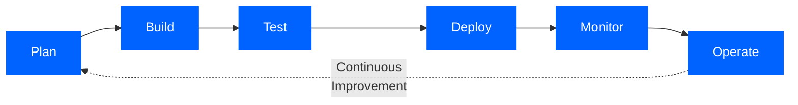
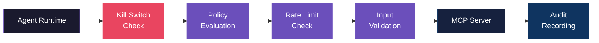

<div align="center">

# CASTELLAN

**Secure AI Agents, Delivered as a Service**

The agent platform that implements the security architecture<br>IBM and Anthropic say every enterprise needs.

<br>

[](https://owasp.org/www-project-top-10-for-large-language-model-applications/)
[](https://www.ibm.com/downloads/documents/us-en/1443d5dd174f42e6)
[](#mcp-gateway)

[](#aegis-security-audit)
[](#vertical-compliance-packs)
[](#deployment-options)

<br>

[Get Started](#get-started) | [Security Architecture](#security-architecture) | [ADLC Alignment](#adlc-alignment) | [Documentation](#documentation)

</div>

<br>

---

<br>

## The Problem

> Everyone is building AI agents. Almost no one is shipping them securely.

Enterprises face a stark choice: move fast and accept the risk, or spend months building the security, governance, and compliance infrastructure that production agents demand.

In October 2025, IBM and Anthropic published [**Architecting Secure Enterprise AI Agents with MCP**](https://www.ibm.com/downloads/documents/us-en/1443d5dd174f42e6) — the definitive blueprint for enterprise-grade agent infrastructure. It defines the **Agent Development Lifecycle (ADLC)**, a six-phase framework extending DevSecOps for AI agents.

<div align="center">
<br>

**Castellan is the reference implementation of that blueprint.**

<br>
</div>

---

<br>

## How It Works

Describe the agent you need in plain English. Castellan delivers a production-grade, security-audited, governance-wrapped agent ready for deployment.

<br>

```
  "A billing support agent that handles refunds, tracks orders,
   escalates disputes over $500 to a human, and complies with PCI-DSS"
```

<br>


<br>

<div align="center">

### What Gets Delivered

</div>

<table>
<tr>
<td width="50%" valign="top">

**Agent Package**
- Fully resolved YAML specification
- Production-ready compiled agent
- Behavioral test suite
- Deployment artifacts

</td>
<td width="50%" valign="top">

**Security & Governance**
- OWASP Top 10 security audit report
- Agent birth certificate (provenance chain)
- Governance dashboard
- Health baseline for drift detection

</td>
</tr>
</table>

<br>

---

<br>

## ADLC Alignment

<div align="center">

*The IBM/Anthropic guide defines six lifecycle phases. Castellan covers every one.*

</div>

<br>



<br>

| | ADLC Phase | IBM/Anthropic Requires | Castellan Delivers |
|:---:|:---:|---|---|
| 1 | **Plan** | Behavior specifications, success criteria | NL intake parser, conversational intake, 21-block library, vertical compliance packs |
| 2 | **Build** | Prompt design, tool orchestration, schemas | 5-stage compiler pipeline, structured output mode, constitutional enforcement |
| 3 | **Test** | Evaluation-first, LLM-as-judge | 28 assertion types, adversarial personas, LLM-as-judge, comparative Elo rating, regression detection |
| 4 | **Deploy** | Kill switches, rollback, hybrid deployment | Multi-environment promotion gates, Docker / K8s / Temporal exports, CI packager |
| 5 | **Monitor** | Drift detection, safety signals, cost tracking | Runtime feedback loop, drift analyzer, OTel spans, Prometheus metrics, budget alerts |
| 6 | **Operate** | Continuous optimization, governance catalogs | Health reports, governance dashboard, birth certificates, Aegis re-audit capability |

<br>

---

<br>

## Security Architecture

<div align="center">

[](#)

</div>

<br>

### Aegis Security Audit

Castellan's **Aegis** engine performs a full OWASP Top 10 for Agentic Applications audit on every agent before deployment. Not a checklist — a real audit engine that produces six deliverables:

<table>
<tr>
<td width="50%" valign="top">

| Document | Audience |
|---|---|
| Executive Summary | CTO / CISO |
| Technical Report | Engineers |
| OWASP Scorecard | All |

</td>
<td width="50%" valign="top">

| Document | Audience |
|---|---|
| Exploit Test Suite | Engineers |
| Candor Report | All |
| Handoff Guide | Engineers |

</td>
</tr>
</table>

<br>

<details>
<summary><b>OWASP Top 10 for Agentic Applications — Full Coverage Map</b></summary>

<br>

| ID | Threat | How Castellan Addresses It |
|:---:|---|---|
| **ASI01** | Prompt Injection | Input filtering guardrail blocks injection, exfiltration, and escalation patterns before they reach the LLM |
| **ASI02** | Tool Poisoning / Chaining | Cross-layer `ToolChainingAnalyzer` traces tool A&rarr;B data flows and validates sinks |
| **ASI03** | Excessive Agency | `PrivilegeScopeAnalyzer` measures blast radius, flags missing rate limits on write tools |
| **ASI04** | Supply Chain Risk | Code audit layer detects hardcoded secrets, dangerous calls, deserialization vulnerabilities |
| **ASI05** | Unsafe Output Handling | PII redaction + hallucination detection guardrails filter every response before delivery |
| **ASI06** | Memory Poisoning | `MemoryPathsAnalyzer` identifies persistent state injection vectors in RAG and working memory |
| **ASI07** | Insecure Delegation | `DelegationAuditAnalyzer` audits agent spawning chains and enforces depth limits |
| **ASI08** | Human Oversight Gaps | Human-in-the-loop gates + `AutonomyEnvelopeAnalyzer` + `KillSwitchAnalyzer` |
| **ASI09** | Trust Exploitation | `ConfidenceCalibrationAnalyzer` flags overconfidence and missing trust scores |
| **ASI10** | Insufficient Monitoring | Kill switch verification, audit log checks, observability completeness analysis |

</details>

<br>

### MCP Gateway

The exact architecture IBM recommends — centralized policy enforcement for all MCP tool calls:



<table>
<tr>
<td width="50%" valign="top">

**Policy Engine**
- Policy-as-code with most-restrictive-wins
- Scoped by tool, server, agent, and tenant
- Priority-sorted rule evaluation

</td>
<td width="50%" valign="top">

**Operational Controls**
- Thread-safe atomic kill switch
- Token-bucket rate limiting (4 scope levels)
- SHA-256 argument hashing in audit trail

</td>
</tr>
</table>

<br>

### Runtime Guardrails

Every LLM response passes through three guardrail layers before reaching the user:

| | Guardrail | What It Catches | Action |
|:---:|---|---|:---:|
| 1 | **PII Redaction** | Emails, SSNs, credit cards, phone numbers, custom patterns | `REDACT` |
| 2 | **Injection Filter** | Prompt injection, data exfiltration, privilege escalation | `BLOCK` |
| 3 | **Hallucination Detection** | Ungrounded claims not supported by tool results or context | `WARN` / `BLOCK` |

> When multiple guardrails fire, the **most restrictive action wins**.

<br>

---

<br>

## Governance & Compliance

<br>

<table>
<tr>
<td width="33%" align="center">

**Birth Certificates**

Agent identity & spec hash (SHA-256)<br>
Constitutional principles<br>
Tool inventory + permissions<br>
Audit findings & OWASP scores<br>
Candor report

</td>
<td width="33%" align="center">

**Promotion Gates**

`test_pass` — behavioral test threshold<br>
`score_threshold` — evaluation minimum<br>
`manual_approval` — human sign-off<br>
`cost_budget` — monthly cost limit<br>
dev &rarr; staging &rarr; production

</td>
<td width="33%" align="center">

**Drift Detection**

Tool usage regression (&gt;30%)<br>
Escalation spikes (&gt;30% &rarr; critical)<br>
Cost anomalies (&gt;50% increase)<br>
Error rate monitoring (&gt;5%)<br>
Gate failure tracking (&gt;10%)

</td>
</tr>
</table>

<br>

### Vertical Compliance Packs

<table>
<tr>
<td width="50%" valign="top">

**Healthcare** &nbsp; `HIPAA`

- HIPAA constitution
- PHI handling protocols
- Clinical workflow governance
- Emergency escalation gates
- Patient communication standards

</td>
<td width="50%" valign="top">

**Finance** &nbsp; `PCI-DSS` `SEC` `AML`

- SEC constitution
- PCI cardholder data handling
- Financial disclaimers enforcement
- Transaction approval gates
- Anti-money laundering checks

</td>
</tr>
</table>

<br>

---

<br>

## Deployment Options

<div align="center">

| | Platform | What You Get |
|:---:|---|---|
| :whale: | **Docker** | Containerized agent with docker-compose |
| :wheel_of_dharma: | **Kubernetes** | K8s manifests with HPA, PDB, and service mesh readiness |
| :zap: | **FastAPI** | HTTP API — `/chat`, `/health`, `/metrics`, `/dashboard` |
| :repeat: | **Temporal** | Durable workflow with per-turn checkpointing and crash recovery |
| :arrows_counterclockwise: | **CI Pipeline** | GitHub Actions or GitLab CI — compile &rarr; test &rarr; audit &rarr; gate |
| :package: | **Client Delivery** | Branded package: API docs, usage dashboard, SLA monitoring |

</div>

<br>

---

<br>

## Observability

<table>
<tr>
<td width="25%" align="center">

**OpenTelemetry**

Spans for every turn,<br>tool call, and<br>gate evaluation

</td>
<td width="25%" align="center">

**Prometheus**

`/metrics` endpoint<br>for monitoring<br>infrastructure

</td>
<td width="25%" align="center">

**Structured Logging**

JSON log lines with<br>correlation IDs and<br>session context

</td>
<td width="25%" align="center">

**Cost Tracking**

Per-session budgets<br>with threshold alerts<br>and model breakdown

</td>
</tr>
</table>

<br>

---

<br>

## Who This Is For

<table>
<tr>
<td width="33%" valign="top">

### Enterprise

**CISOs, CTOs, Compliance Teams**

You need agents that meet regulatory requirements. Castellan delivers OWASP-audited agents with birth certificates, audit trails, and compliance-specific governance — out of the box.

</td>
<td width="33%" valign="top">

### Consultancies

**AI Agencies & System Integrators**

You're building agents for clients in regulated industries. Castellan gives you the security infrastructure so you can focus on business logic, and hand off a governance package compliance teams will accept.

</td>
<td width="33%" valign="top">

### Founders

**Technical Leaders & Startups**

You want to ship AI agents without spending months building the security stack. Castellan gets you from idea to production-grade, audited agent in a single pipeline run.

</td>
</tr>
</table>

<br>

---

<br>

<div align="center">

## The Name

*Castellan* (n.) — **the keeper of a castle.**

The person responsible for the defense and governance of a fortified position.

That's what this does for your AI agents.

<br>

---

<br>

## Get Started

[](mailto:rtwolfe@gmail.com)
[](https://t.me/timwolfe)
[](tel:+16503905003)

[](#)

<br>

**Security Whitepaper Alignment:** [IBM & Anthropic — Architecting Secure Enterprise AI Agents with MCP](https://www.ibm.com/downloads/documents/us-en/1443d5dd174f42e6) (October 2025)

<br>

---

<br>

**Castellan — Secure AI Agents, Delivered as a Service**

Built on the architecture IBM and Anthropic recommend. Ready for production.

<br>

</div>
