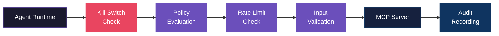
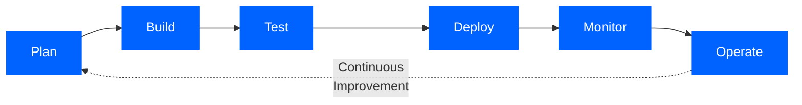

<div align="center">

# CASTELLAN

**The Reference Implementation of the IBM/Anthropic Enterprise Agent Blueprint**

In October 2025, IBM and Anthropic published the definitive framework for<br>
production-grade AI agents. Castellan is the only platform built to that spec.

<br>

[](https://owasp.org/www-project-top-10-for-large-language-model-applications/)
[](https://www.ibm.com/downloads/documents/us-en/1443d5dd174f42e6)
[](#mcp-gateway)

[](#aegis-security-audit)
[](#vertical-compliance-packs)
[](#deployment-options)

<br>

[The Problem](#the-problem) | [What You Get](#what-you-get) | [Security Architecture](#security-architecture) | [ADLC Alignment](#adlc-alignment) | [Get Started](#get-started)

</div>

<br>

---

<br>

## The Problem

Your security team is going to ask three questions about every AI agent you deploy:

1. **Is it OWASP-compliant?** Can you produce a scorecard?
2. **What is its provenance?** Who approved it, what spec was it built from, has it drifted?
3. **What happens when it goes wrong?** Is there a kill switch, an audit trail, a human gate?

Most teams deploying agents today cannot answer any of these. Castellan exists to change that.

<br>

---

<br>

## How It Works

Describe the agent you need. Castellan delivers a production-grade, OWASP-audited, governance-wrapped agent — along with every artifact your security team needs to approve it.

<br>

```
  "A billing support agent that handles refunds, tracks orders,
   escalates disputes over $500 to a human, and complies with PCI-DSS"
```

<br>


<br>

---

<br>

## What You Get

Every Castellan deployment produces two packages — one for engineering, one for security and compliance.

<br>

<table>
<tr>
<td width="50%" valign="top">

### Agent Package

- Production-ready compiled agent
- Fully resolved YAML specification
- Behavioral test suite (28 assertion types)
- Docker / K8s / Temporal deployment artifacts
- CI pipeline integration

</td>
<td width="50%" valign="top">

### Governance Package

- **OWASP Agentic Top 10 scorecard** — the document your CISO needs
- **Agent birth certificate** — SHA-256 spec hash, provenance chain, constitutional principles, audit findings
- **Governance dashboard** — usage, cost, gate events
- **Health baseline** — drift detection from day one
- **Compliance report** — HIPAA / PCI-DSS / SEC where applicable

</td>
</tr>
</table>

> *The governance package is what gets agents approved by compliance teams. It's not an afterthought — it's a first-class output.*

<br>

---

<br>

## Security Architecture

<div align="center">

[](#)

</div>

<br>

### Aegis Security Audit

Every agent is audited by **Aegis** before deployment — a full OWASP Top 10 for Agentic Applications review engine. Not a checklist. Not a static scan. A real audit that produces six deliverables your security team can act on:

<table>
<tr>
<td width="50%" valign="top">

| Document | Audience |
|---|---|
| Executive Summary | CTO / CISO |
| Technical Report | Engineers |
| OWASP Scorecard | Compliance |

</td>
<td width="50%" valign="top">

| Document | Audience |
|---|---|
| Exploit Test Suite | Engineers |
| Candor Report | All |
| Handoff Guide | Engineers |

</td>
</tr>
</table>

<br>

<details>
<summary><b>OWASP Top 10 for Agentic Applications — Full Coverage Map</b></summary>

<br>

| ID | Threat | How Castellan Addresses It |
|:---:|---|---|
| **ASI01** | Prompt Injection | Input filtering guardrail blocks injection, exfiltration, and escalation patterns before they reach the LLM |
| **ASI02** | Tool Poisoning / Chaining | Cross-layer `ToolChainingAnalyzer` traces tool A→B data flows and validates sinks |
| **ASI03** | Excessive Agency | `PrivilegeScopeAnalyzer` measures blast radius, flags missing rate limits on write tools |
| **ASI04** | Supply Chain Risk | Code audit layer detects hardcoded secrets, dangerous calls, deserialization vulnerabilities |
| **ASI05** | Unsafe Output Handling | PII redaction + hallucination detection guardrails filter every response before delivery |
| **ASI06** | Memory Poisoning | `MemoryPathsAnalyzer` identifies persistent state injection vectors in RAG and working memory |
| **ASI07** | Insecure Delegation | `DelegationAuditAnalyzer` audits agent spawning chains and enforces depth limits |
| **ASI08** | Human Oversight Gaps | Human-in-the-loop gates + `AutonomyEnvelopeAnalyzer` + `KillSwitchAnalyzer` |
| **ASI09** | Trust Exploitation | `ConfidenceCalibrationAnalyzer` flags overconfidence and missing trust scores |
| **ASI10** | Insufficient Monitoring | Kill switch verification, audit log checks, observability completeness analysis |

</details>

<br>

### MCP Gateway

The exact architecture IBM recommends — centralized policy enforcement for all MCP tool calls:



<table>
<tr>
<td width="50%" valign="top">

**Policy Engine**
- Policy-as-code with most-restrictive-wins
- Scoped by tool, server, agent, and tenant
- Priority-sorted rule evaluation

</td>
<td width="50%" valign="top">

**Operational Controls**
- Thread-safe atomic kill switch
- Token-bucket rate limiting (4 scope levels)
- SHA-256 argument hashing in audit trail

</td>
</tr>
</table>

<br>

### Runtime Guardrails

Every LLM response passes through three guardrail layers before reaching the user:

| | Guardrail | What It Catches | Action |
|:---:|---|---|:---:|
| 1 | **PII Redaction** | Emails, SSNs, credit cards, phone numbers, custom patterns | `REDACT` |
| 2 | **Injection Filter** | Prompt injection, data exfiltration, privilege escalation | `BLOCK` |
| 3 | **Hallucination Detection** | Ungrounded claims not supported by tool results or context | `WARN` / `BLOCK` |

> When multiple guardrails fire, the **most restrictive action wins**.

<br>

---

<br>

## ADLC Alignment

<div align="center">

*IBM and Anthropic's joint whitepaper defines the Agent Development Lifecycle — six phases every enterprise agent must pass through. Castellan covers every one.*

[**Architecting Secure Enterprise AI Agents with MCP**](https://www.ibm.com/downloads/documents/us-en/1443d5dd174f42e6) — IBM & Anthropic, October 2025

</div>

<br>



<br>

| | ADLC Phase | IBM/Anthropic Requires | Castellan Delivers |
|:---:|:---:|---|---|
| 1 | **Plan** | Behavior specifications, success criteria | NL intake parser, conversational intake, 21-block library, vertical compliance packs |
| 2 | **Build** | Prompt design, tool orchestration, schemas | 5-stage compiler pipeline, structured output mode, constitutional enforcement |
| 3 | **Test** | Evaluation-first, LLM-as-judge | 28 assertion types, adversarial personas, LLM-as-judge, comparative Elo rating, regression detection |
| 4 | **Deploy** | Kill switches, rollback, hybrid deployment | Multi-environment promotion gates, Docker / K8s / Temporal exports, CI packager |
| 5 | **Monitor** | Drift detection, safety signals, cost tracking | Runtime feedback loop, drift analyzer, OTel spans, Prometheus metrics, budget alerts |
| 6 | **Operate** | Continuous optimization, governance catalogs | Health reports, governance dashboard, birth certificates, Aegis re-audit capability |

<br>

---

<br>

## Vertical Compliance Packs

Regulated industries need more than generic security. Castellan ships with domain-specific governance built in.

<br>

<table>
<tr>
<td width="50%" valign="top">

### Healthcare &nbsp; `HIPAA`

Agents handling PHI need a different standard than generic AI guardrails.

- **HIPAA constitution** — minimum necessary access, PHI redaction, consent directives
- **PHI handling protocols** — no logging, no cross-record sharing, access verification
- **Clinical workflow governance** — distinguishes general health info from medical advice
- **Emergency escalation gates** — immediate human handoff on safety-critical signals
- **Patient communication standards** — warm, clear, never diagnostic

</td>
<td width="50%" valign="top">

### Finance &nbsp; `PCI-DSS` `SEC` `AML`

Agents in financial workflows are subject to regulatory scrutiny that generic security won't satisfy.

- **SEC constitution** — disclosure requirements, speculation guardrails, audit trails
- **PCI cardholder data handling** — no PAN storage, masked display, compliant transmission
- **Financial disclaimers enforcement** — required language on every relevant output
- **Transaction approval gates** — human-in-the-loop above configurable thresholds
- **AML checks** — pattern detection for structuring and suspicious activity

</td>
</tr>
</table>

<br>

---

<br>

## Governance & Compliance

<br>

<table>
<tr>
<td width="33%" align="center">

**Birth Certificates**

Agent identity & spec hash (SHA-256)<br>
Constitutional principles<br>
Tool inventory + permissions<br>
Audit findings & OWASP scores<br>
Candor report

</td>
<td width="33%" align="center">

**Promotion Gates**

`test_pass` — behavioral test threshold<br>
`score_threshold` — evaluation minimum<br>
`manual_approval` — human sign-off<br>
`cost_budget` — monthly cost limit<br>
dev → staging → production

</td>
<td width="33%" align="center">

**Drift Detection**

Tool usage regression (>30%)<br>
Escalation spikes (>30% → critical)<br>
Cost anomalies (>50% increase)<br>
Error rate monitoring (>5%)<br>
Gate failure tracking (>10%)

</td>
</tr>
</table>

<br>

---

<br>

## Who This Is For

<table>
<tr>
<td width="50%" valign="top">

### Enterprise Security & Compliance Teams

Your engineering team is deploying AI agents. Your job is to make sure they're safe to run in production. Castellan gives you the artifact set to do that: OWASP scorecards, birth certificates with spec hashes, promotion gates that require human sign-off, and drift alerts when agent behavior changes after deployment.

You don't have to build the audit infrastructure. It's already there.

</td>
<td width="50%" valign="top">

### Consultancies in Regulated Industries

You're building AI agents for clients in healthcare, finance, and legal. Your clients have compliance teams that will ask hard questions. Castellan gives you a governance package — OWASP scorecard, birth certificate, compliance report — that those teams can evaluate and accept.

It's the difference between a client deployment that stalls in security review and one that moves through it.

</td>
</tr>
</table>

<br>

---

<br>

## Deployment Options

<div align="center">

| | Platform | What You Get |
|:---:|---|---|
| 🐳 | **Docker** | Containerized agent with docker-compose |
| ⚙️ | **Kubernetes** | K8s manifests with HPA, PDB, and service mesh readiness |
| ⚡ | **FastAPI** | HTTP API — `/chat`, `/health`, `/metrics`, `/dashboard` |
| 🔁 | **Temporal** | Durable workflow with per-turn checkpointing and crash recovery |
| 🔄 | **CI Pipeline** | GitHub Actions or GitLab CI — compile → test → audit → gate |
| 📦 | **Client Delivery** | Branded package: API docs, usage dashboard, SLA monitoring |

</div>

<br>

---

<br>

## Observability

<table>
<tr>
<td width="25%" align="center">

**OpenTelemetry**

Spans for every turn,<br>tool call, and<br>gate evaluation

</td>
<td width="25%" align="center">

**Prometheus**

`/metrics` endpoint<br>for monitoring<br>infrastructure

</td>
<td width="25%" align="center">

**Structured Logging**

JSON log lines with<br>correlation IDs and<br>session context

</td>
<td width="25%" align="center">

**Cost Tracking**

Per-session budgets<br>with threshold alerts<br>and model breakdown

</td>
</tr>
</table>

<br>

---

<br>

<div align="center">

## The Name

*Castellan* (n.) — **the keeper of a castle.**

The person responsible for the defense and governance of a fortified position.

That's what this does for your AI agents.

<br>

---

<br>

## Get Started

[](mailto:rtwolfe@gmail.com)
[](https://t.me/timwolfe)
[](tel:+16503905003)

[](#)

<br>

**Security Whitepaper:** [IBM & Anthropic — Architecting Secure Enterprise AI Agents with MCP](https://www.ibm.com/downloads/documents/us-en/1443d5dd174f42e6) (October 2025)

<br>

---

<br>

**Castellan — The reference implementation of the IBM/Anthropic enterprise agent blueprint.**

Built on the architecture IBM and Anthropic recommend. Governance-ready from day one.

</div>
